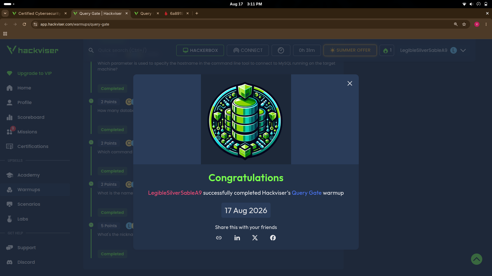

# CORE — Certified Cybersecurity Foundations

Documentation of my completion of Hackviser's **CORE (Certified Cybersecurity Foundations)** certification — 19/19 modules, 100% completion, issued 17 Aug 2026.

This repo covers my hands-on work across two sections of the certification: **Cryptology Fundamentals** (decoding/hash-cracking labs) and the **Query Gate** practical exercise (a live MySQL enumeration box), with terminal commands, tools, and reasoning documented for each.

## Certificate

## Modules Completed

| # | Module | Status |
|---|--------|--------|
| 01 | Introduction | ✅ 1/1 |
| 02 | Threat and Incident Management | ✅ 2/2 |
| 03 | Network and Web Fundamentals | ✅ 3/3 |
| 04 | Generative AI Security | ✅ 1/1 |
| 05 | Reconnaissance and Social Engineering | ✅ 2/2 |
| 06 | Cryptology Fundamentals | ✅ 6/6 |
| 07 | Practical Exercises | ✅ 4/4 |

## Cryptology Fundamentals — Decoding Challenges

Each challenge provided a file encoded with a different scheme; the task was to recover the original plaintext. All were solved and cross-verified using both **CyberChef** and **Python** (via terminal on Ubuntu), so results could be double-checked two different ways.

| Encoding | Tool(s) Used | Recovered Text |
|---|---|---|
| Binary | CyberChef `From Binary` | `GirlWithAPearlEarringVermeer` |
| Decimal/ASCII | CyberChef `From Decimal` | `StarryNightVanGogh` |
| Base64 | CyberChef `From Base64` | `MonaLisaDaVinci` |
| URL Encoding | CyberChef `URL Decode` | `TheScreamMunch` |
| Hex | CyberChef `From Hex` | `TheBirthOfVenusBotticelli` |
| Base32 | CyberChef `From Base32` | `ThePersistenceOfMemoryDali` |
| Quoted-Printable | CyberChef `From Quoted Printable` | `TheNightWatchRembrandt` |
| HTML Character Entities | Python `html.unescape()` | `FishermenAtSeaTurner` |
| Uuencoding | Python `binascii.a2b_uu()` | `TheKissKlimt` |

Full write-up: [`writeups/cryptology-fundamentals.md`](writeups/cryptology-fundamentals.md)

## Hashing Techniques — Hash Cracking

MD5 and SHA1 are one-way functions, so these were solved by lookup against precomputed hash tables (CrackStation) rather than "decoding."

| Algorithm | Hash | Cracked Value |
|---|---|---|
| MD5 | `8dbdda48fb8748d6746f1965824e966a` | `simple` |
| SHA1 | `7610bae85f2b530654cc716772f1fe653373e892` | `leonardo` |

## Query Gate — Live MySQL Enumeration

A "Basic" difficulty practical exercise: enumerate a live target machine and extract data from a misconfigured MySQL server.

**Methodology:**
1. **Recon** — `nmap 172.20.14.206` → found port `3306/tcp open mysql`
2. **Access** — `mysql -u root -h 172.20.14.206` connected **without a password**, confirming a misconfigured root account
3. **Enumeration** — `SHOW DATABASES;` revealed 5 databases, including a custom one: `detective_inspector`
4. **Table discovery** — `USE detective_inspector; SHOW TABLES;` revealed a `hacker_list` table
5. **Data extraction** — `SELECT * FROM hacker_list;` returned 9 records tagged by hacker type (`gray-hat`, `black-hat`, `white-hat`) — identified the white-hat hacker as `Hackviser` / nickname `h4ckv1s3r`

Full write-up with terminal output and screenshots: [`writeups/query-gate.md`](writeups/query-gate.md)

## Tools Used

- [CyberChef](https://gchq.github.io/CyberChef/) — encoding/decoding operations
- Python 3 (`html`, `binascii` modules) — cross-verification of decodes
- [nmap](https://nmap.org/) — port scanning / recon
- MySQL client (`mysql` CLI) — database enumeration
- [CrackStation](https://crackstation.net/) — hash lookup/cracking
- Ubuntu 24.04 (native terminal)

## About This Certification

CORE is Hackviser's entry-level cybersecurity certification, covering threat/incident management, network and web fundamentals, GenAI security, reconnaissance/social engineering, cryptology, and hands-on practical exercises. More info: [Hackviser Certifications](https://app.hackviser.com/certifications/core)

---

*Documented by [Mistah Goddy](https://github.com/MistahGoddy) — cybersecurity student @ ICE HUB, Enugu State, Nigeria.*
