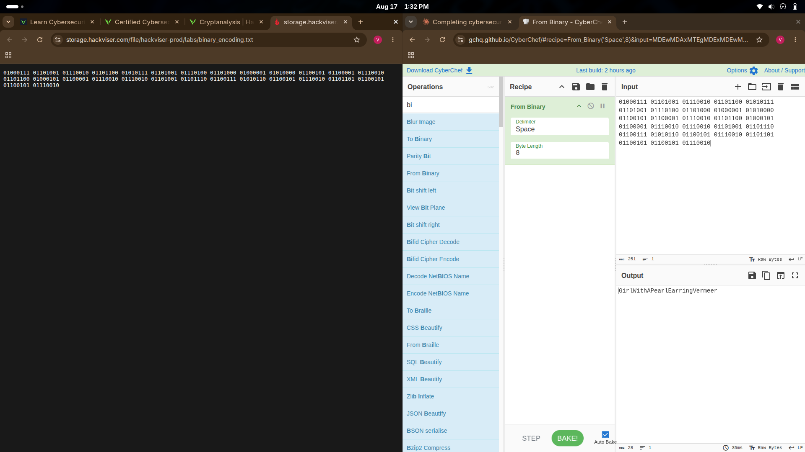
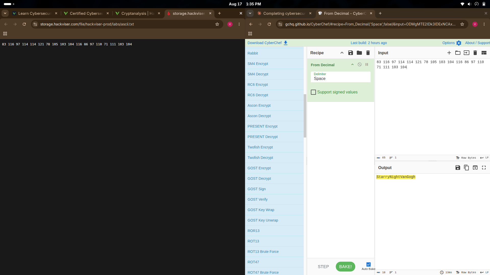
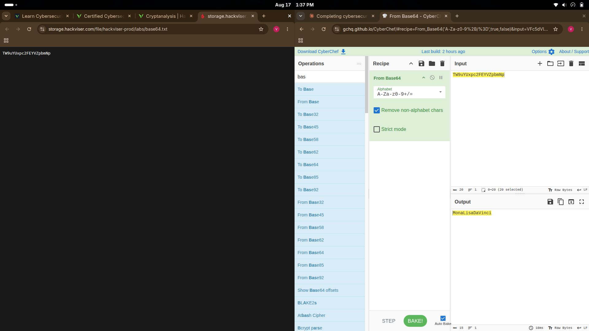
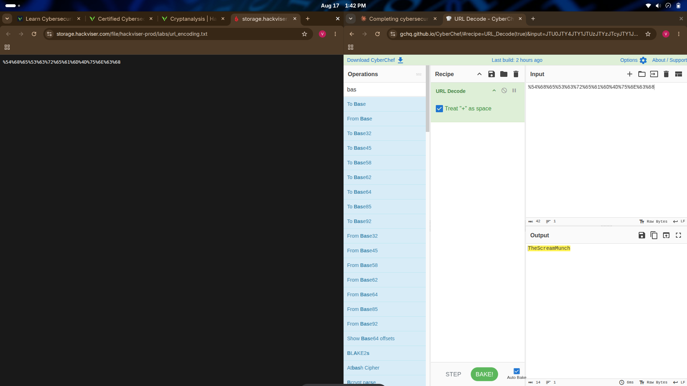
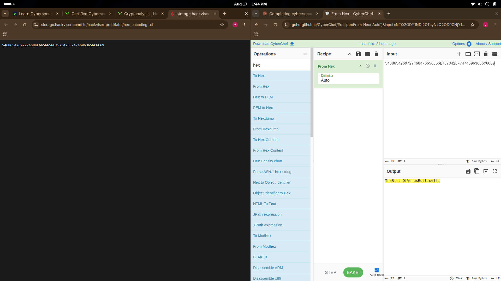
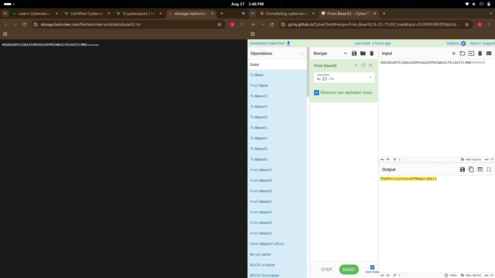
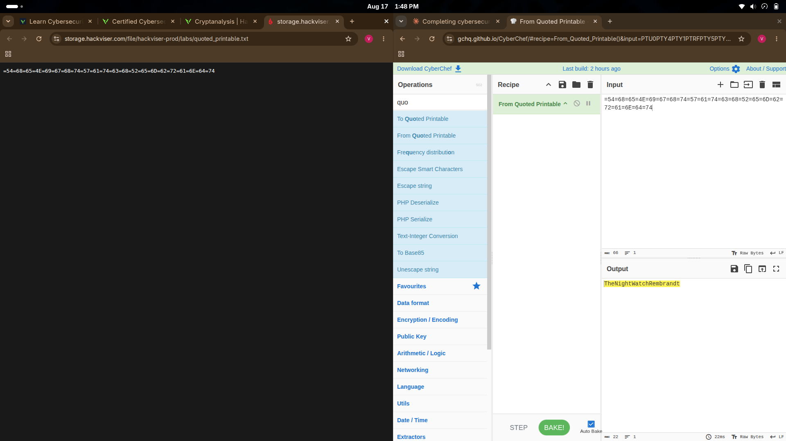
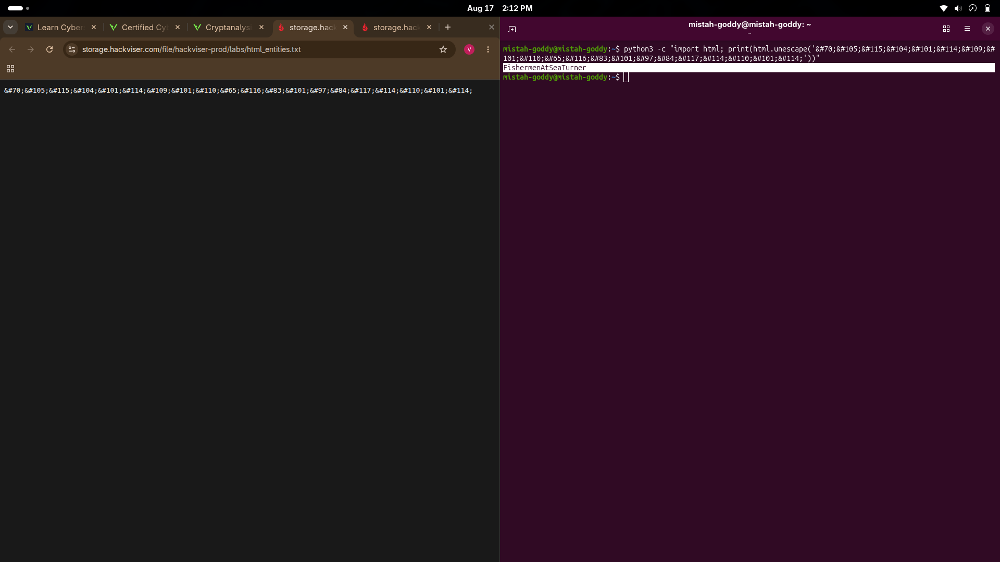
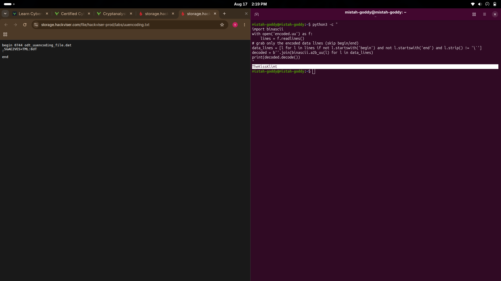
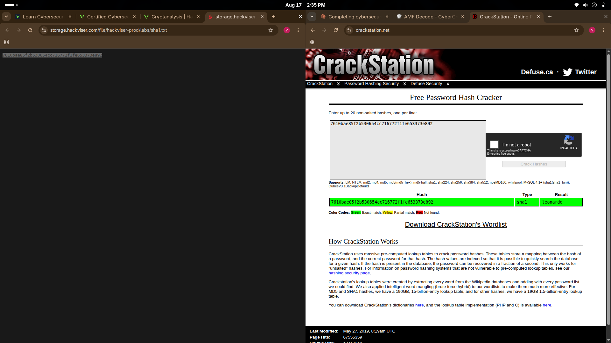

# Cryptology Fundamentals — Write-up

All challenges in this module followed the same pattern: a file containing an encoded string, where the decoded plaintext is a famous painting title concatenated with its artist's surname (no spaces). This module tests recognition and correct application of common encoding schemes, not cryptography — everything here is reversible without a key.

## Binary

**Input:**
```
01000111 01101001 01110010 01101100 01010111 01101001 01110100 01101000 ...
```

**Method:** CyberChef → `From Binary` (Delimiter: Space, Byte Length: 8)

**Result:** `GirlWithAPearlEarringVermeer`



## Decimal / ASCII

**Input:**
```
83 116 97 114 114 121 78 105 103 104 116 86 97 110 71 111 103 104
```

**Method:** CyberChef → `From Decimal` (Delimiter: Space)

**Result:** `StarryNightVanGogh`



## Base64

**Input:**
```
TW9uYUxpc2FEYVZpbmNp
```

**Method:** CyberChef → `From Base64`

**Result:** `MonaLisaDaVinci`



## URL Encoding

**Input:**
```
%54%68%65%53%63%72%65%61%6D%4D%75%6E%63%68
```

**Method:** CyberChef → `URL Decode`

**Result:** `TheScreamMunch`



## Hex

**Input:**
```
546865426972746F664656E75734F664426F7474696365 6C6C69
```

**Method:** CyberChef → `From Hex` (Delimiter: Auto)

**Result:** `TheBirthOfVenusBotticelli`



## Base32

**Input:**
```
KRUGKUDFOJZWS43UMVXGGZKPMZGWK3LPOJ4UIYLMNE======
```

**Method:** CyberChef → `From Base32`

**Result:** `ThePersistenceOfMemoryDali`



## Quoted-Printable

**Input:**
```
=54=68=65=4E=69=67=68=74=57=61=74=63=68=52=65=6D=62=72=61=6E=64=74
```

**Method:** CyberChef → `From Quoted Printable`

**Result:** `TheNightWatchRembrandt`



## HTML Character Entities

**Input:**
```
&#70;&#105;&#115;&#104;&#101;&#114;&#109;&#101;&#110;&#65;&#116;&#83;&#101;&#97;&#84;&#117;&#114;&#110;&#101;&#114;
```

**Method:** Python `html.unescape()` (terminal, Ubuntu)

```bash
python3 -c "import html; print(html.unescape('&#70;&#105;&#115;&#104;&#101;&#114;&#109;&#101;&#110;&#65;&#116;&#83;&#101;&#97;&#84;&#117;&#114;&#110;&#101;&#114;'))"
```

**Result:** `FishermenAtSeaTurner`



## Uuencoding

**Input:**
```
begin 0744 odt_uuencoding_file.dat
,5&AE2VES<TML:6UT
`
end
```

**Method:** Python `binascii.a2b_uu()` (terminal, Ubuntu)

```bash
python3 -c "
import binascii
with open('encoded.uu') as f:
    lines = f.readlines()
data_lines = [l for l in lines if not l.startswith('begin') and not l.startswith('end') and l.strip() != '\`']
decoded = b''.join(binascii.a2b_uu(l) for l in data_lines)
print(decoded.decode())
"
```

**Result:** `TheKissKlimt`



---

## Hashing Techniques

MD5 and SHA1 are **one-way** hash functions — there is no algorithm to reverse them directly. The only viable approach is a lookup against precomputed hash tables (rainbow tables) or brute-force/dictionary attacks. Both hashes below were resolved via [CrackStation](https://crackstation.net/), which maintains a 190GB, 15-billion-entry lookup table for MD5/SHA1.

### MD5

**Hash:** `8dbdda48fb8748d6746f1965824e966a`

**Cracked value:** `simple`


### SHA1

**Hash:** `7610bae85f2b530654cc716772f1fe653373e892`

**Cracked value:** `leonardo`


